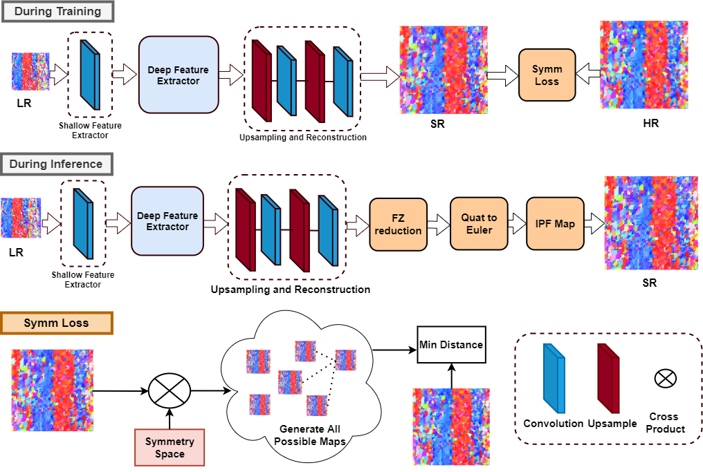

# EBSD-Superresolution: Adaptable Physics-Based Super-Resolution for Electron Backscatter Diffraction Maps
[Devendra K. Jangid*](https://www.sites.google.com/view/dkj910/), [Neal R. Brodnik*](https://scholar.google.com/citations?user=3dAoFJkAAAAJ&hl=en), [Michael G. Goebel](https://scholar.google.com/citations?user=FwMJrygAAAAJ&hl=en), [Amil Khan](https://scholar.google.com/citations?user=r6jNH5UAAAAJ&hl=en), [SaiSidharth Majeti](), [McLean P. Echlin](https://scholar.google.com/citations?user=fxN2OsUAAAAJ&hl=en), [Samantha H. Daly](https://scholar.google.com/citations?user=3whYx4UAAAAJ&hl=en), [Tresa M. Pollock](https://materials.ucsb.edu/people/faculty/tresa-pollock), [B.S. Manjunath](https://scholar.google.com/citations?user=wRYM4qgAAAAJ&hl=en)

[* equal contirbution]

[paper]()

> **Abstract:** *In computer vision, single image super-resolution (SISR) has been extensively explored using convolutional neural networks (CNNs) on optical images, but images outside this domain, such as those from scientific experiments, are not well investigated. Experimental data is often gathered using non-optical methods, which alters the metrics for image quality. One such example is electron backscatter diffraction (EBSD), a materials characterization technique that maps crystal arrangement in solid materials, which provides insight into processing, structure, and property relationships.  We present a broadly adaptable approach for applying state-of-art SISR networks to generate super-resolved EBSD orientation maps.  This approach includes quaternion-based orientation recognition, loss functions that consider rotational effects and crystallographic symmetry, and an inference pipeline to convert network output into established visualization formats for EBSD maps. The ability to generate physically accurate, high-resolution EBSD maps with super-resolution enables high throughput characterization and broadens the capture capabilities for three-dimensional experimental EBSD datasets.*

## EBSD Framework

